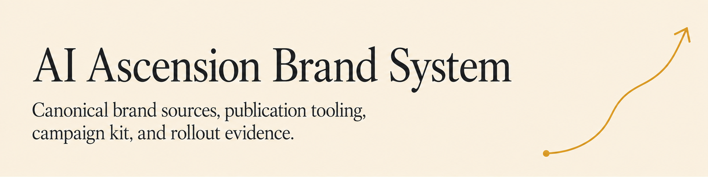

<picture>
  <source media="(prefers-color-scheme: dark)" srcset="brand/assets/github/ascension-brand-overhaul-banner-dark.png">
  <source media="(prefers-color-scheme: light)" srcset="brand/assets/github/ascension-brand-overhaul-banner-light.png">
  
</picture>

# AI Ascension — complete brand-overhaul execution package

**Target repository:** `AI-Ascension/ascension-brand-overhaul`
**Original agent configuration requested:** Luna/max for 47 ordinary roles and Astra/max for two depth-3 art-author roles. The recorded user amendment authorizes root image generation with the available tool; model/backend identity remains unknown. See [the amendment](art/root-generation-authorization.json).
**Hierarchy:** root → workstream leads → work-package coordinators → implementation/review specialists.

This repository contains the executed engineering, text and partial artwork for the overhaul, together with the binding brief and recorded amendments. The private repository and reviewed draft PRs were created. The website, offline publisher, measurement contracts, migration tooling, presentation copy, and twelve-week content kit have local verification records. All 115 planned export files exist, with 123 generated sources preserved including superseded attempts. Seventy of 72 families pass scoped source/export acceptance. Two briefs still require approved footage integration or real challenge approval, and the requested native depth-three hierarchy remains outstanding. This is not a completed rebrand or live launch.

This is a **private audit source handoff**. Internal model ancestry and operation receipts are retained to satisfy the execution audit. Do not make the repository or local archive public without a separate content/privacy review and explicit publication authority. Raw private trajectories, captures, provider diagnostics, credentials, and font binaries are excluded.

## Handoff

Read `delivery/FINAL_REPORT.md` for generated requirement, asset, and external-operation states; `delivery/RUNBOOK.md` for reproducible checks and exact remaining dependencies. `MASTER_PROMPT.md` and `START_HERE.md` remain the original assignment. The proposed PRs are drafts, and merges, renames, deployments, and campaign sends remain separately gated.

## Main documents

| File | Use |
|---|---|
| `MASTER_PROMPT.md` | Root implementation assignment and definition of completion. |
| `orchestration/CONTRACT.md` | Real three-level delegation, runtime verification, ownership, and budgets. |
| `orchestration/roles.json` | The complete 49-role descendant tree. |
| `orchestration/roles/` | Individually scoped prompts for 7 leads, 14 coordinators, and 28 leaf specialists. |
| `specs/` | Website, identity, repository migration, publishing, marketing, measurement, and release requirements. |
| `art/ASTRA_GPT_IMAGE_2_POLICY.md` | Mandatory all-art generation policy, model roles, provenance, and no-fallback rules. |
| `art/ASTRA_ART_PROMPT_AUTHOR.md` | Dedicated author meta-prompt for the actual Astra leaf. |
| `REVISION_NOTES.md` | Version-2 changes, preserved scope, and model exceptions. |
| `art/ART_MAP.md` | Human-readable inventory of every planned asset family. |
| `art/asset-board.html` | Offline searchable art board: placement, production method, exports, and evidence requirements. |
| `art/asset-registry.json` | Machine-readable art map and exact expected export paths. |
| `art/PROMPTBOOK.md` | Individual briefs for the actual Astra prompt author; not pre-attested final prompts. |
| `data/requirements.json` | Requirement-to-owner, acceptance, and evidence mapping. |
| `prompts/` | Continuation, adversarial audit/repair, and approved-release prompts. |
| `scripts/` and `tests/` | Package checks, orchestration-ledger checks, and asset validation helpers. |
| `MANIFEST.json` and `CHECKSUMS.sha256` | Delivery file inventory and integrity hashes. |

## Local package checks

Requires Python 3.10 or newer and the pinned development dependencies in `requirements-dev.txt`.

```sh
python3 -m venv .venv
.venv/bin/python -m pip install -r requirements-dev.txt
.venv/bin/python scripts/validate_package.py
.venv/bin/python -m unittest discover -s tests -v
```

These commands validate the package and local implemented contracts. They do not execute agents, produce brand art, mutate GitHub, deploy a site, or prove product readiness.

## Main decisions retained

AI Ascension is the organization name; Ascension is the flagship product; The Climb is the content series. Retain the `AI-Ascension` handle. Consolidate the public experience at `aiascension.tech`; preserve historical GitHub Pages evidence. Keep the warm Ascent Ledger design language. Use descriptive component names, not a mythology-themed name for every service.

No actual font files, proprietary game files, credentials, or unpublished gameplay captures are included.

## Artwork revision

The current artwork route is `user_authorized_root_image_tool`. Root authors and preserves exact prompts, generated raster sources, input references and hashes; independent reviewers assess source use, visuals and mechanical exports. The available tool does not attest the author model or image backend, so these remain unknown. The original Astra-specific route remains documented for historical traceability.

The map still covers 72 artwork families, three authentic evidence-media families and five historical/reference records across 16 surfaces. Genuine evidence is not synthesized, and legacy art remains reference/archive-only. Read [artwork access](brand/ART_ACCESS.md), [the actual acceptance record](execution/root-art-acceptance.json) and [remaining creative work](brand/remaining-artwork.json). Image generation resumed successfully after the historical service limit. Verified artwork does not itself authorize public downloads, deployment or distribution of this private archive.

The current [private website artwork candidate](delivery/WEBSITE_CANDIDATE.md) is included as a restorable Git bundle; its source revision and review receipts are recorded separately from the existing public website draft PR.
